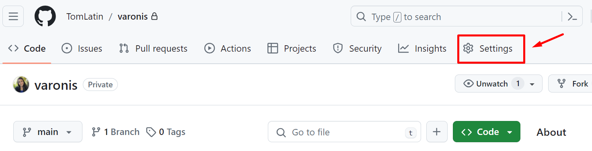
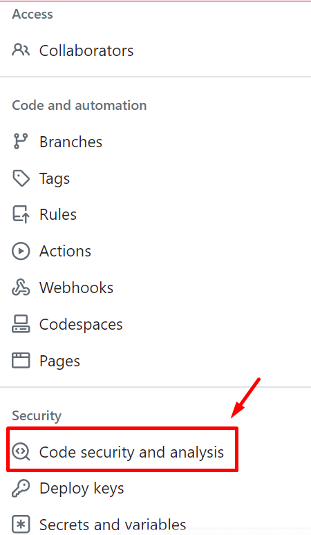
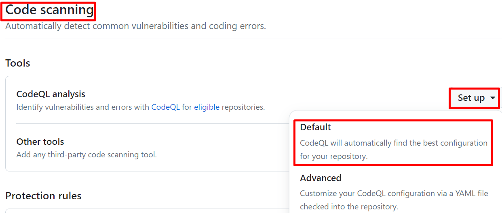
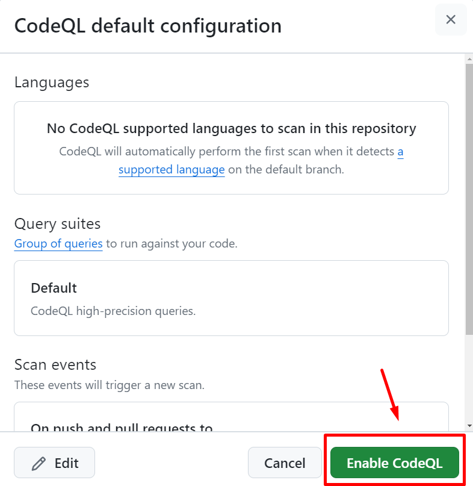
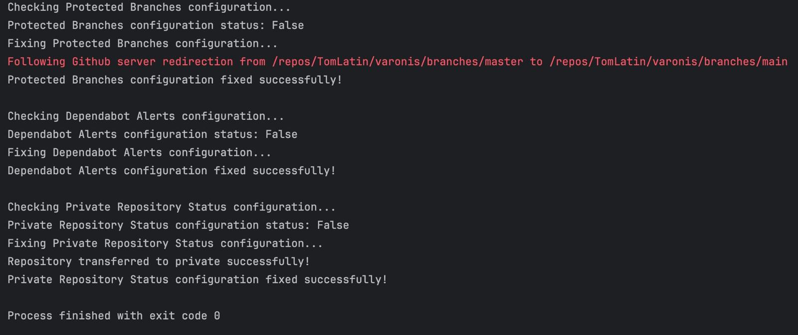

# <span style="color:darkblue">Overview:</span>

1. [5 configurations with a security impact](#specific-configurations)
2. [Misconfigurations for non-technical persons](#misconfigurations)
3. [How to expand the script into a framework](#expand-the-script)
4. [How to set up and run the script](#setup-script)
5. [How running it will impact working with GitHub](#github-impact)

## <span style="color:darkblue" id="specific-configurations">5 configurations with a security impact:</span>

1. **Managing protected branches**:
   - **NIST Category:** Configuration Management
   - **Meaning:** Controls who can merge, push to specific branches, ensuring code integrity.
   - **Security Impact:** Safeguards critical branches from unauthorized changes, fostering code stability and reliability.
   - **Link for more information:** [Managing Protected Branches](https://docs.github.com/en/repositories/configuring-branches-and-merges-in-your-repository/managing-protected-branches)

2. **Dependabot alerts**:
   - **NIST Category:** Supply Chain Risk Management
   - **Meaning:** Ensures the security of third-party dependencies by staying up-to-date with security patches and updates.
   - **Security Impact:** Enhances the security posture by proactively addressing vulnerabilities in dependencies.
   - **Link for more information:** [Dependabot alerts](https://docs.github.com/en/code-security/dependabot/dependabot-alerts)

3. **Private and Public Repository Status**:
   - **NIST Category:** Access Control
   - **Meaning:** Defines whether a repository is accessible to the public or restricted to authorized users.
   - **Security Impact:** Controlling repository access ensures that sensitive code and data are protected from 
                          unauthorized access, reducing the risk of data breaches and leaks.
   - **Link for more information:** [Private and Public Repository Status](https://docs.github.com/en/rest/repos?apiVersion=2022-11-28)

4. **Enforce HTTPS for GitHub Pages**:
   - **NIST Category:** System and Communications Protection
   - **Meaning:** Enforcing HTTPS (Hypertext Transfer Protocol Secure) for GitHub Pages ensures that data exchanged 
                  between users and the GitHub Pages site is encrypted, protecting it from interception and tampering. 
                  HTTPS encrypts the communication channel, providing confidentiality and integrity for data transmitted 
                  over the network.
   - **Security Impact:** Secures data exchanged with GitHub Pages from interception and tampering

5. **Code Scanning Alerts**:
   - **NIST Category:** Audit and Accountability
   - **Meaning:** Code scanning alerts provide automated security analysis of code repositories, identifying potential 
                  vulnerabilities, security weaknesses, and compliance issues early in the development lifecycle. 
                  These alerts help developers detect and address security issues promptly, improving code quality and 
                  reducing the risk of security breaches.
   - **Security Impact:** By proactively identifying security vulnerabilities and compliance issues in code, 
                          code scanning alerts enhance the confidentiality, integrity, and availability of software 
                          applications hosted on GitHub. They empower developers to address security weaknesses 
                          before they are exploited by attackers, 
                          thereby minimizing the risk of data breaches and ensuring compliance with security standards 
                          and regulations.
   - **Link for more information:** [Code Scanning Alerts](https://docs.github.com/en/code-security/code-scanning)

## <span style="color:darkblue" id="misconfigurations">Misconfigurations for Non-Technical Persons:</span>
## Before we dive into the misconfigurations regarding "Code Scanning Alerts" let's understand some of the terms:
- **Code:** Instructions written in a computer language that tell the computer what to do.
- **GitHub:** A platform where people store and manage their code, making it easy for teams to collaborate on projects.
- **Repository:** A place where all the code for a project is stored, organized, and managed.
- **Code Scanning Alerts:** Automated warnings that check code for potential security problems, 
                            helping developers find and fix issues early to make their code safer and better.
- **Vulnerabilities:** Weaknesses in code that can be exploited by attackers to compromise security.
- **MITRE ATT&CK:** A framework used to classify and describe the tactics, techniques, 
                    and procedures (TTPs) employed by attackers during cyberattacks. 
- **Database:** A structured collection of data that is stored and accessed electronically, 
                typically organized in a way that enables efficient retrieval, manipulation, and management.
- **SQL injection:** A type of cyberattack where malicious SQL code is inserted into input fields of a web application, 
                     exploiting vulnerabilities in the application's database layer to access or manipulate sensitive data.

## Code Scanning Alerts:
- **What it means?** <br/>
  Code scanning alerts provide automated security analysis of code repositories, identifying potential vulnerabilities, 
  security weaknesses, and compliance issues early in the development lifecycle. These alerts help developers detect and 
  address security issues promptly, improving code quality and reducing the risk of security breaches. 
- **What are the best practices?** <br/>
  Enable code scanning alerts for your GitHub repositories to automatically identify and address security 
  vulnerabilities and compliance issues in your code.
- **What happens when the configuration is not configured according to the best practice, and the risks involved?** <br/>
  Imagine you're building a house without inspecting the materials you're using. Without checking for weak spots or 
  defects, the house could collapse or be easily broken into. Similarly, without code scanning alerts, 
  developers might miss hidden flaws in their code, making it vulnerable to hackers. This could result in data leaks, 
  system failures, or violations of security regulations
  For example, if a developer accidentally embeds passwords directly into the code, 
  without code scanning alerts, these secrets could be overlooked. Hackers could then exploit this oversight to access
  sensitive systems, potentially causing data breaches or regulatory non-compliance
- **Steps to fix the configuration manually:** <br/>
  1. On GitHub.com, navigate to the main page of the repository.
  2. Under your repository name, click  Settings. If you cannot see the "Settings" tab, select the  dropdown menu, then click Settings. <br />
      <br style="clear:both;"/>
  3. In the "Security" section of the sidebar, click  Code security and analysis. <br />
      <br style="clear:both;"/>
  4. In the "Code scanning" section, select Set up , then click Default and Enable CodeQL analysis. <br />
     <br style="clear:both;"/> <br/>  
      <br style="clear:both;"/>
  
   You can see the official guide [here](https://docs.github.com/en/code-security/code-scanning/enabling-code-scanning/configuring-default-setup-for-code-scanning)  
   You can read [here](https://docs.github.com/en/get-started/learning-about-github/about-github-advanced-security) on the Advance Configuration of Code Scanning Alerts 

- **How will changing the configuration impact working with GitHub?** <br/>
  Enabling code scanning alerts may result in more frequent notifications and alerts for security vulnerabilities and 
  compliance issues in your code. However, it enhances the security and reliability of your software applications by 
  empowering developers to address security weaknesses promptly.
- **Which MITER ATT&CK is associated with Code Scanning Alerts configuration?**
   "Exploit Public-Facing Application" (T1190). Essentially, this means attackers look for vulnerabilities in 
    applications that are accessible to the public.
    If our developers miss these vulnerabilities in their code and our code scanning alerts don't catch them, 
    it's like leaving the front door of our digital house wide open for intruders. For example, 
    a missed vulnerability like a SQL injection flaw could allow attackers to sneak into our database and 
    steal sensitive information without us even realizing it.


## <span style="color:darkblue" id="the-script">How to Expand the Script into a Framework:</span>
The Misconfiguration Monitoring and Fixing Framework is designed to provide automated checks and fixes for 
misconfigurations across multiple services, with a focus on enhancing security and compliance posture. 
This document outlines the structure, usage, and important considerations for the framework.
### Framework Structure

1. **Modular Design**: 
   - Encapsulates each misconfiguration check and fix within its own module or class.
   - Ensures flexibility and scalability for easy addition or removal of configurations.

2. **Central Configuration Management**: 
   - Manages details such as authentication tokens, repository information, and other parameters centrally.
   
3. **Logging and Reporting**: 
   - Records the status of each configuration operation and generates comprehensive reports.
   
4. **Error Handling**: 
   - Implements robust error handling mechanisms to handle exceptions gracefully.
   
5. **Extensibility**: 
   - Facilitates the addition of new misconfigurations and corresponding check-fix modules without core modifications.

### Usage

1. **Initialization**: 
   - Requires users to provide necessary authentication tokens and configuration details during initialization.
   
2. **Configuration Checks**: 
   - Allows users to initiate checks for specific misconfigurations or all supported configurations.
   
3. **Fix Operations**: 
   - Automatically fixes identified misconfigurations based on predefined procedures.
   
4. **Reporting**: 
   - Generates comprehensive reports summarizing the status of misconfigurations and actions taken.

### Important Considerations

1. **Security**: 
   - Ensures security of authentication tokens and sensitive configuration details.
   
2. **Scalability**: 
   - Accommodates monitoring and fixing of misconfigurations across a large number of services.
   
3. **Documentation**: 
   - Provides thorough documentation covering installation, configuration, usage, and troubleshooting.
   
4. **Community Engagement**: 
   - Encourages contributions, feedback, and collaboration from users and developers.
   
5. **Integration**: 
   - Explores integration possibilities with existing monitoring and management tools.

## <span style="color:darkblue" id="github-impact">How to Set Up and Run the Script:</span>

### Prerequisites
Before setting up and running the script, ensure you have the following prerequisites installed:
- Python 3.x
- PyGithub library

You can install the PyGithub library using pip:

```bash
pip install PyGithub
```
### Configuration
- GitHub Authentication Token:
Obtain a GitHub authentication token with appropriate permissions to access and modify repositories.
Replace the placeholder TOKEN = '' in the script with your GitHub authentication token.
- Repository Information:
Update the REPO_OWNER and REPO_NAME variables in the script with the owner and name of the target repository.

### Running the Script
To run the script and fix misconfigurations:
1. Open a terminal or command prompt.
2. Navigate to the directory containing the fix_misconfigurations.py script.
3. Execute the script using Python:
```bash
python misconfiguration_monitoring.py
```

## <span style="color:darkblue" id="setup-script">Impact of Running `fix_misconfigurations.py`:</span>
## Enhanced Security and Access Control

- **Enhanced Security**: Converts public branches to private, bolstering access control.
- **Efficient Management**: Automates conversion process, ensuring consistency.
- **Communication and Reporting**: Notifies stakeholders of access control changes.
- **Workflow Optimization**: Integrates seamlessly with existing workflows.
- **Continuous Improvement**: Enables iterative enhancement based on feedback..

## <span style="color:darkblue" id="setup-script">Output of `fix_misconfigurations.py`:</span>
 <br style="clear:both;"/>